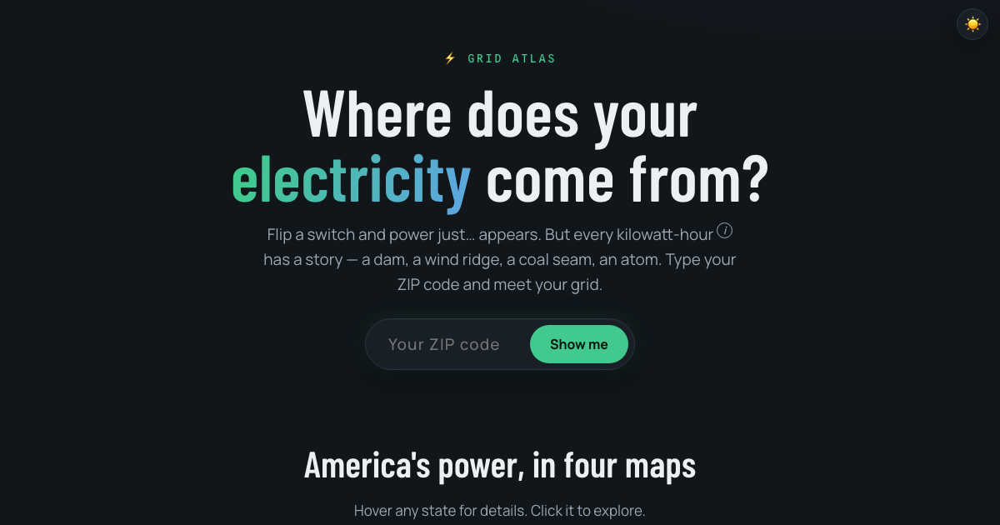

<p align="center">
  
</p>

# Grid Atlas

**Type your ZIP code. Meet your grid.**

<p align="center">
  <a href="https://maninae.github.io/grid-atlas/"><strong>maninae.github.io/grid-atlas →</strong></a>
</p>

Flip a switch and power just… appears. But every kilowatt-hour has a story —
a dam, a wind ridge, a coal seam, an atom. Grid Atlas pulls back the curtain
on the US electric grid using free public EPA and EIA data, with no signup
and no API calls — your ZIP never leaves your browser.

---

## What you can see

- **Your fuel mix** — the actual share of solar, wind, hydro, nuclear, gas, coal,
  and the rest that makes your local electricity, down to your EPA eGRID subregion
- **Your carbon cost** — grams of CO₂ per kilowatt-hour, ranked against all 27 US
  grid regions (Vermont vs. West Virginia is a 45× spread)
- **A typical day on your grid** — hour-by-hour fuel mix averaged over all of 2025,
  with a scroll-driven walk through nuclear's overnight hum, solar's noon bulge,
  and the evening battery handoff
- **25 years of change** — your state's full fuel-mix trend from 2001 to today,
  next to residential electricity prices over the same window
- **Every US power plant** — all 13,400+ operable utility-scale plants mapped by
  size and fuel, with your state's biggest ones called out
- **A researched grid history for every state + D.C.** — the dams, deals, and
  disasters that shaped each grid, every claim source-linked
- **A Texas-only utility picker** — TX is deregulated, so the EPA's "predominant
  utility" pick misattributes about a third of ZIPs; pick yours from the list or
  choose "I pick my own plan (retail choice)"
- **Dark/light themes**, and every chart exports as a shareable PNG

---

## Where the numbers come from

Everything is free, public US government data, baked into static JSON at
build time. The live site makes zero data API calls.

| What | Source | Vintage |
|---|---|---|
| Fuel mix & 25-year trends | [EIA state generation data](https://www.eia.gov/electricity/data/state/) + [EIA API v2](https://www.eia.gov/opendata/) | 2001–2025 |
| CO₂ per kWh, ZIP → grid region, subregion boundaries | [EPA eGRID](https://www.epa.gov/egrid) | 2023 (newest official release) |
| Hour-by-hour grid mix | [EIA-930 Hourly Grid Monitor](https://www.eia.gov/electricity/gridmonitor/) | 2025 |
| Power plant locations & sizes | [EIA US Energy Atlas](https://atlas.eia.gov/datasets/eia::power-plants/about) | 2026 |
| Residential electricity prices | [EIA retail sales](https://www.eia.gov/electricity/data.php) | 2001–2025 |
| Utility rates by ZIP | [NREL / OpenEI](https://data.openei.org/submissions/8563) (CC-BY 4.0) | 2024 |

Numbers count utility-scale generation only — rooftop solar is tracked
separately and not included. ZIPs that straddle two grid regions get their
main one, same as the EPA's own lookup. Not affiliated with the EPA or EIA.

---

## How it's built

No framework, no bundler, no backend. Static HTML + ES modules + D3 v7 +
topojson-client, hosted on GitHub Pages. A small Python pipeline in
[`build/`](build/CLAUDE.md) turns the raw EPA/EIA files into the compact JSON
in `data/` — six scripts, one `download.sh`, runs in a few minutes when new
data drops.

```bash
python3 -m http.server 8000   # then open http://localhost:8000
```

---

## License

[MIT](LICENSE). Data is owned by its respective US government / NREL sources
under their original terms.
